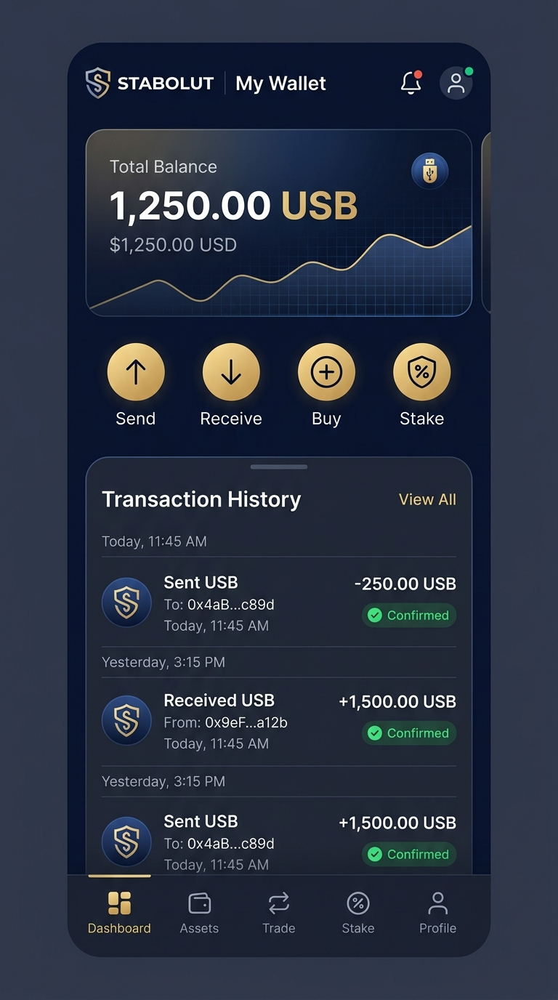
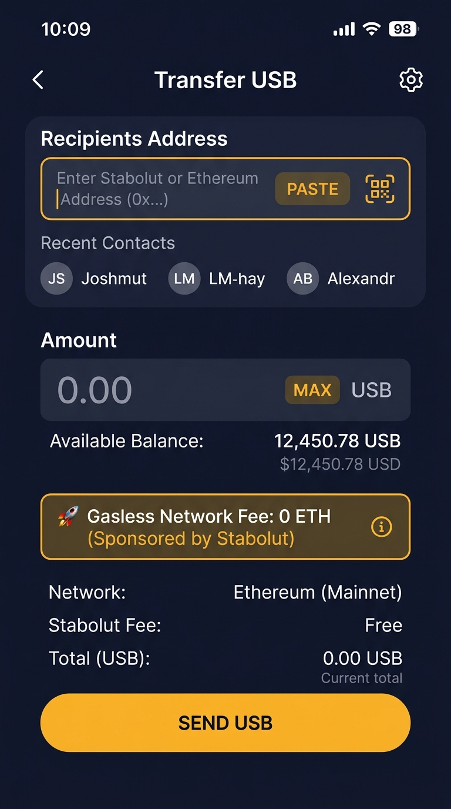
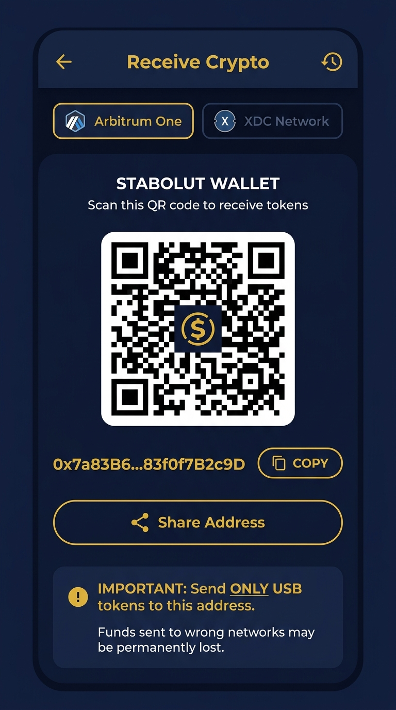
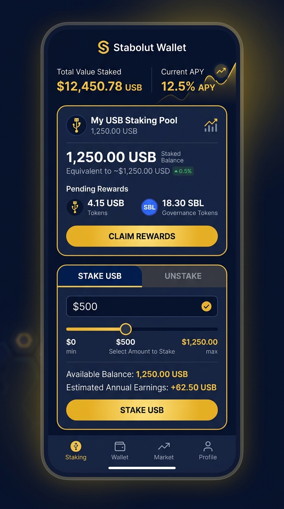

# Stabolut Mobile Wallet

[](https://opensource.org/licenses/MIT)
[](https://reactnative.dev/)
[]()
[](https://play.google.com/store/apps/details?id=com.stabolut.usb)

A non-custodial, gasless cryptocurrency mobile wallet built with **React Native** for the **Stabolut Ecosystem** (USB Token on Arbitrum & XDC).

---

## 📲 Download on Google Play

<a href="https://play.google.com/store/apps/details?id=com.stabolut.usb">
  
</a>

👉 **Direct Link:** [https://play.google.com/store/apps/details?id=com.stabolut.usb](https://play.google.com/store/apps/details?id=com.stabolut.usb)

---

## 📸 Mobile App Interface & UI Screens

| **1. Wallet Dashboard** | **2. Gasless Transfer** | **3. Receive & QR Code** | **4. Staking & Yield** |
| :---: | :---: | :---: | :---: |
|  |  |  |  |

---

## 📱 Key Features

- **Non-Custodial HD Wallet**: Create, backup, and restore wallets using 12-word mnemonic phrases or raw private keys.
- **Gasless Token Transfers**: Send USB tokens without needing ETH for gas via ERC-865 / EIP-712 pre-signed meta-transactions.
- **Biometric & PIN Lock**: Secure access via Face ID / Touch ID, custom PIN codes, and hardware-backed keystores.
- **Staking Management**: Stake USB tokens directly inside the wallet and track yields in real-time.
- **QR Code Scanner**: Scan recipient addresses and present your own QR code to receive funds.
- **Live Push Notifications & WebSockets**: Instant notifications when tokens are sent or received.
- **Light & Dark Theme**: Built-in theme customization.

---

## 💻 Prerequisites

Ensure your development environment meets the requirements for React Native CLI:

1. **Node.js**: `>= 18.x` ([nodejs.org](https://nodejs.org/))
2. **Java Development Kit**: JDK 17 (recommended for React Native 0.73)
3. **Android Studio** (for Android):
   - Android SDK Platform 34
   - Android Virtual Device (AVD) emulator or physical device with USB debugging
4. **Xcode & CocoaPods** (for iOS, macOS only):
   - Xcode 15+
   - CocoaPods (`sudo gem install cocoapods`)

---

## 🚀 Step-by-Step Setup Guide

### 1. Clone the Repository
```bash
git clone https://github.com/Stabolut/mobile.git
cd mobile
```

### 2. Install JavaScript Dependencies
```bash
npm install
```

### 3. (iOS Only) Install CocoaPods
```bash
cd ios
pod install
cd ..
```

---

## ⚙️ Connecting to Backend & Blockchain

The mobile app connects to the **Stabolut Backend** for gasless relaying, address book contacts, and user profiles.

### Local Development Setup:
Open [`src/common/strings.js`](src/common/strings.js) and configure your endpoints:

```javascript
const Str = {
  // Public Arbitrum Sepolia RPC (or your custom RPC endpoint)
  rpcUrl: "https://sepolia-rollup.arbitrum.io/rpc",

  // USB Token Smart Contract Address on Arbitrum
  contractAddress: "0x24c8479b8af9742c5160e0c29197e87a584cfe99",

  // Backend API URL:
  // - For Android Emulator: Use "http://10.0.2.2:8003/api/v1/stabolut"
  // - For Physical Device: Use "http://<YOUR_LOCAL_WIFI_IP>:8003/api/v1/stabolut"
  // - For iOS Simulator: Use "http://localhost:8003/api/v1/stabolut"
  apiUrl: "http://10.0.2.2:8003/api/v1/stabolut",
  socketUrl: "http://10.0.2.2:8003",
};
```

---

## 🏃 Running the Application

### Step 1: Start the Metro Bundler
In the project root directory, run:
```bash
npm start
```
*Keep this terminal window open.*

### Step 2: Launch the App

#### For Android:
Open a new terminal window in the `mobile/` directory:
```bash
npm run android
```

#### For iOS (macOS only):
Open a new terminal window in the `mobile/` directory:
```bash
npm run ios
```

---

## 🧪 Troubleshooting

- **Android Build Fails with Gradle Error**:
  Run `cd android && ./gradlew clean && cd ..` and restart Metro with `npm start -- --reset-cache`.
- **Cannot Connect to Local Backend on Android Emulator**:
  Use `http://10.0.2.2:8003` instead of `localhost` because `localhost` refers to the Android device itself.
- **Node Modules / Linking Issues**:
  Remove `node_modules` and re-run:
  ```bash
  rm -rf node_modules && npm install
  ```

---

## 🤝 Contributing

Please read [CONTRIBUTING.md](CONTRIBUTING.md) for details on submitting issues and pull requests.

---

## 📄 License

This project is licensed under the **MIT License** - see the [LICENSE](LICENSE) file for details.
